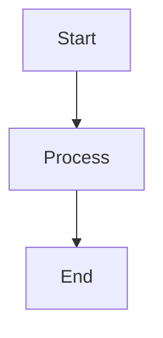
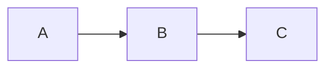
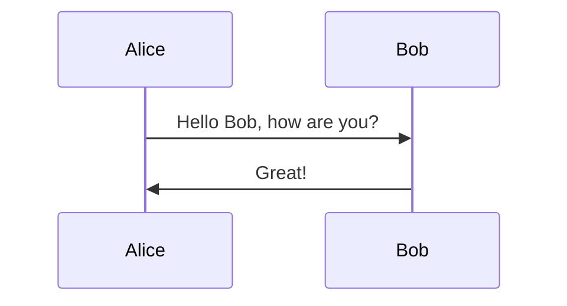
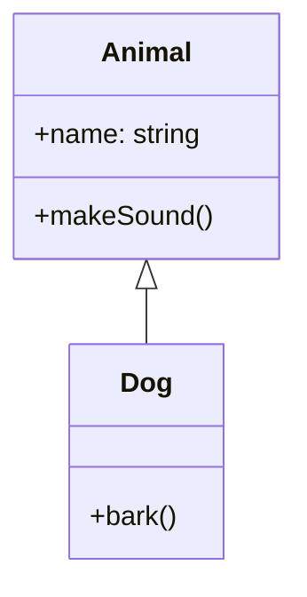

# Mermaid Test

## Simple Test Diagram



## Flowchart Test



## Sequence Diagram Test



## Class Diagram Test



## Troubleshooting Steps

1. **Check if the minimal diagram above renders**
2. **If it renders, the issue is with your specific diagram syntax**
3. **If it doesn't render, there's a setup issue**

### 2. **If the Minimal Diagram Renders**

- The issue is likely with the specific Mermaid block (e.g., custom classDef/class lines).
- Try removing the `classDef` and `class` lines from your original diagram.

### 3. **If the Minimal Diagram Does NOT Render**

- There may be a deeper issue with your Docusaurus install or a cache problem.
- Try deleting `node_modules` and `package-lock.json`, then reinstall:
  ```sh
  rm -rf node_modules package-lock.json
  npm install
  npm start
  ```
- Make sure you are accessing the doc via the sidebar, not as a static file.

### 4. **Check Browser Console for Errors**

- Open DevTools (F12) and check the Console for any errors when viewing the doc.

## Summary

- Your sidebar and config are correct.
- If a minimal Mermaid diagram in a new doc does not render, the problem is with the Docusaurus install or cache.
- If it does render, the problem is with the specific diagram syntax.

**Try the minimal test and let me know the result. I can then give you the exact fix!**