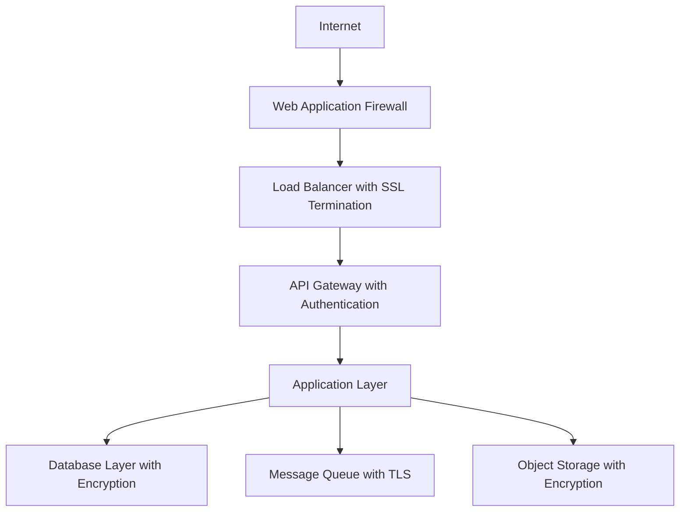

# Cloud Security

This document outlines the comprehensive security strategy for the Educational Platform for Bad Data Science, covering data protection, access control, compliance, and security monitoring.

## Security Architecture Overview

The platform implements a multi-layered security approach following the principle of defense in depth:



## Authentication and Authorization

### Multi-Factor Authentication (MFA)

```yaml
# MFA Configuration
mfa_settings:
  required_for:
    - admin_users: true
    - teacher_accounts: true
    - student_accounts: false
  methods:
    - totp: true          # Time-based One-Time Password
    - sms: true           # SMS verification
    - email: true         # Email verification
    - hardware_keys: true # FIDO2/WebAuthn
  backup_codes:
    enabled: true
    count: 10
    single_use: true
```

#### TOTP Implementation

```python
import pyotp
import qrcode
from io import BytesIO

class MFAService:
    def __init__(self):
        self.issuer_name = "Educational Platform"
    
    def generate_secret(self, user_email):
        """Generate a new TOTP secret for user"""
        secret = pyotp.random_base32()
        
        # Store secret in database (encrypted)
        self.store_user_secret(user_email, secret)
        
        return secret
    
    def generate_qr_code(self, user_email, secret):
        """Generate QR code for TOTP setup"""
        totp_uri = pyotp.totp.TOTP(secret).provisioning_uri(
            name=user_email,
            issuer_name=self.issuer_name
        )
        
        qr = qrcode.QRCode(version=1, box_size=10, border=5)
        qr.add_data(totp_uri)
        qr.make(fit=True)
        
        img = qr.make_image(fill_color="black", back_color="white")
        
        # Convert to bytes for transmission
        img_buffer = BytesIO()
        img.save(img_buffer, format='PNG')
        return img_buffer.getvalue()
    
    def verify_totp(self, user_email, token):
        """Verify TOTP token"""
        secret = self.get_user_secret(user_email)
        if not secret:
            return False
        
        totp = pyotp.TOTP(secret)
        return totp.verify(token, valid_window=1)  # Allow 30-second window
```

### OAuth 2.0 / OpenID Connect Integration

```python
from authlib.integrations.flask_oauth2 import AuthorizationServer
from authlib.oauth2.rfc6749.grants import AuthorizationCodeGrant

class PlatformAuthorizationCodeGrant(AuthorizationCodeGrant):
    def authenticate_user(self, credential):
        """Authenticate user with email/password + MFA"""
        user = User.query.filter_by(email=credential.username).first()
        
        if not user or not user.check_password(credential.password):
            return None
        
        # Check if MFA is required
        if user.mfa_enabled:
            # Require MFA verification in next step
            user.mfa_pending = True
            user.save()
        
        return user

# OAuth2 Server Configuration
authorization_server = AuthorizationServer(app)
authorization_server.register_grant(PlatformAuthorizationCodeGrant)

# Scopes definition
SCOPES = {
    'read:profile': 'Read user profile information',
    'read:devices': 'Read device data and status',
    'write:devices': 'Control and configure devices',
    'read:projects': 'Access project information',
    'write:projects': 'Create and manage projects',
    'admin:users': 'Manage user accounts (admin only)',
    'analytics:read': 'Access analytics and reports',
    'data:export': 'Export data from the platform'
}
```

### Role-Based Access Control (RBAC)

```python
from enum import Enum
from functools import wraps

class Role(Enum):
    SUPER_ADMIN = "super_admin"
    INSTITUTION_ADMIN = "institution_admin"
    TEACHER = "teacher"
    STUDENT = "student"
    DEVICE_MANAGER = "device_manager"
    OBSERVER = "observer"

class Permission(Enum):
    # User management
    CREATE_USER = "create_user"
    READ_USER = "read_user"
    UPDATE_USER = "update_user"
    DELETE_USER = "delete_user"
    
    # Device management
    CREATE_DEVICE = "create_device"
    READ_DEVICE = "read_device"
    UPDATE_DEVICE = "update_device"
    DELETE_DEVICE = "delete_device"
    CONTROL_DEVICE = "control_device"
    
    # Project management
    CREATE_PROJECT = "create_project"
    READ_PROJECT = "read_project"
    UPDATE_PROJECT = "update_project"
    DELETE_PROJECT = "delete_project"
    
    # Data access
    READ_DATA = "read_data"
    EXPORT_DATA = "export_data"
    ANNOTATE_DATA = "annotate_data"

# Role-Permission Matrix
ROLE_PERMISSIONS = {
    Role.SUPER_ADMIN: [p for p in Permission],  # All permissions
    Role.INSTITUTION_ADMIN: [
        Permission.CREATE_USER, Permission.READ_USER, Permission.UPDATE_USER,
        Permission.CREATE_DEVICE, Permission.READ_DEVICE, Permission.UPDATE_DEVICE,
        Permission.CREATE_PROJECT, Permission.READ_PROJECT, Permission.UPDATE_PROJECT,
        Permission.READ_DATA, Permission.EXPORT_DATA
    ],
    Role.TEACHER: [
        Permission.READ_USER, Permission.CREATE_PROJECT, Permission.READ_PROJECT,
        Permission.UPDATE_PROJECT, Permission.READ_DEVICE, Permission.UPDATE_DEVICE,
        Permission.READ_DATA, Permission.EXPORT_DATA, Permission.ANNOTATE_DATA
    ],
    Role.STUDENT: [
        Permission.READ_PROJECT, Permission.READ_DEVICE, Permission.READ_DATA,
        Permission.ANNOTATE_DATA
    ],
    Role.DEVICE_MANAGER: [
        Permission.CREATE_DEVICE, Permission.READ_DEVICE, Permission.UPDATE_DEVICE,
        Permission.DELETE_DEVICE, Permission.CONTROL_DEVICE
    ],
    Role.OBSERVER: [
        Permission.READ_PROJECT, Permission.READ_DEVICE, Permission.READ_DATA
    ]
}

def require_permission(permission):
    """Decorator to enforce permission requirements"""
    def decorator(f):
        @wraps(f)
        def decorated_function(*args, **kwargs):
            if not current_user.has_permission(permission):
                abort(403, description="Insufficient permissions")
            return f(*args, **kwargs)
        return decorated_function
    return decorator

# Usage example
@app.route('/api/v1/devices', methods=['POST'])
@require_permission(Permission.CREATE_DEVICE)
def create_device():
    # Device creation logic
    pass
```

## Data Encryption

### Encryption at Rest

```python
from cryptography.fernet import Fernet
from cryptography.hazmat.primitives import hashes
from cryptography.hazmat.primitives.kdf.pbkdf2 import PBKDF2HMAC
import base64
import os

class EncryptionService:
    def __init__(self, password: bytes):
        """Initialize encryption service with master password"""
        salt = os.urandom(16)
        kdf = PBKDF2HMAC(
            algorithm=hashes.SHA256(),
            length=32,
            salt=salt,
            iterations=100000,
        )
        key = base64.urlsafe_b64encode(kdf.derive(password))
        self.cipher = Fernet(key)
        self.salt = salt
    
    def encrypt_sensitive_data(self, data: str) -> str:
        """Encrypt sensitive data like PII"""
        if isinstance(data, str):
            data = data.encode()
        
        encrypted_data = self.cipher.encrypt(data)
        return base64.urlsafe_b64encode(encrypted_data).decode()
    
    def decrypt_sensitive_data(self, encrypted_data: str) -> str:
        """Decrypt sensitive data"""
        encrypted_bytes = base64.urlsafe_b64decode(encrypted_data.encode())
        decrypted_data = self.cipher.decrypt(encrypted_bytes)
        return decrypted_data.decode()

# Database field encryption
class EncryptedField:
    def __init__(self, encryption_service):
        self.encryption_service = encryption_service
    
    def encrypt_field(self, value):
        if value is None:
            return None
        return self.encryption_service.encrypt_sensitive_data(value)
    
    def decrypt_field(self, encrypted_value):
        if encrypted_value is None:
            return None
        return self.encryption_service.decrypt_sensitive_data(encrypted_value)

# Usage in database models
class User(db.Model):
    id = db.Column(db.String(36), primary_key=True)
    email = db.Column(db.String(255), unique=True, nullable=False)
    
    # Encrypted fields
    _first_name = db.Column('first_name', db.Text)
    _last_name = db.Column('last_name', db.Text)
    _phone = db.Column('phone', db.Text)
    
    @property
    def first_name(self):
        return encryption_field.decrypt_field(self._first_name)
    
    @first_name.setter
    def first_name(self, value):
        self._first_name = encryption_field.encrypt_field(value)
```

### Encryption in Transit

```yaml
# TLS Configuration
tls_config:
  version: "1.3"
  cipher_suites:
    - "TLS_AES_256_GCM_SHA384"
    - "TLS_CHACHA20_POLY1305_SHA256"
    - "TLS_AES_128_GCM_SHA256"
  certificate_authority: "Let's Encrypt"
  certificate_renewal: "automatic"
  hsts_enabled: true
  hsts_max_age: 31536000

# MQTT TLS Configuration for IoT devices
mqtt_tls:
  ca_cert: "/etc/ssl/certs/ca-cert.pem"
  cert_file: "/etc/ssl/certs/server-cert.pem"
  key_file: "/etc/ssl/private/server-key.pem"
  tls_version: "tlsv1.2"
  ciphers: "ECDHE+AESGCM:ECDHE+CHACHA20:DHE+AESGCM:DHE+CHACHA20:!aNULL:!MD5:!DSS"
```

## Key Management

### Azure Key Vault Integration

```python
from azure.keyvault.secrets import SecretClient
from azure.identity import DefaultAzureCredential

class KeyVaultService:
    def __init__(self, vault_url):
        """Initialize Azure Key Vault client"""
        credential = DefaultAzureCredential()
        self.client = SecretClient(vault_url=vault_url, credential=credential)
    
    def get_secret(self, secret_name):
        """Retrieve secret from Key Vault"""
        try:
            secret = self.client.get_secret(secret_name)
            return secret.value
        except Exception as e:
            logger.error(f"Failed to retrieve secret {secret_name}: {e}")
            raise
    
    def set_secret(self, secret_name, secret_value):
        """Store secret in Key Vault"""
        try:
            self.client.set_secret(secret_name, secret_value)
            logger.info(f"Secret {secret_name} stored successfully")
        except Exception as e:
            logger.error(f"Failed to store secret {secret_name}: {e}")
            raise
    
    def rotate_secret(self, secret_name, new_value):
        """Rotate existing secret"""
        # Store new version
        self.set_secret(secret_name, new_value)
        
        # Update application configuration
        self.update_application_config(secret_name, new_value)
        
        logger.info(f"Secret {secret_name} rotated successfully")

# Key rotation schedule
KEY_ROTATION_SCHEDULE = {
    'database_password': '90d',      # Every 90 days
    'api_keys': '30d',               # Every 30 days
    'jwt_signing_key': '365d',       # Annually
    'encryption_keys': '180d'        # Every 6 months
}
```

## Network Security

### Web Application Firewall (WAF)

```yaml
# Azure Application Gateway WAF Configuration
waf_config:
  mode: "Prevention"
  rule_set: "OWASP_3.2"
  
  custom_rules:
    - name: "RateLimitRule"
      priority: 100
      action: "Block"
      conditions:
        - match_variable: "RemoteAddr"
          operator: "IPMatch"
          match_values: ["0.0.0.0/0"]
      rate_limit:
        duration: "PT1M"  # 1 minute
        threshold: 100    # requests
    
    - name: "GeoBlockRule"
      priority: 200
      action: "Block"
      conditions:
        - match_variable: "RemoteAddr"
          operator: "GeoMatch"
          match_values: ["CN", "RU", "KP"]  # Block specific countries
    
    - name: "SQLInjectionRule"
      priority: 300
      action: "Block"
      conditions:
        - match_variable: "RequestBody"
          operator: "Contains"
          match_values: ["UNION SELECT", "DROP TABLE", "'; --"]

  managed_rules:
    exclusions:
      - match_variable: "RequestArgNames"
        selector: "project_description"
        exclusion_type: "StartsWith"
```

### Network Segmentation

```yaml
# Virtual Network Configuration
network_architecture:
  vpc_cidr: "10.0.0.0/16"
  
  subnets:
    web_tier:
      cidr: "10.0.1.0/24"
      type: "public"
      security_groups: ["web-sg"]
    
    app_tier:
      cidr: "10.0.2.0/24"
      type: "private"
      security_groups: ["app-sg"]
    
    database_tier:
      cidr: "10.0.3.0/24"
      type: "private"
      security_groups: ["db-sg"]
    
    iot_tier:
      cidr: "10.0.4.0/24"
      type: "private"
      security_groups: ["iot-sg"]

  security_groups:
    web-sg:
      ingress:
        - protocol: "tcp"
          port: 443
          source: "0.0.0.0/0"
        - protocol: "tcp"
          port: 80
          source: "0.0.0.0/0"
    
    app-sg:
      ingress:
        - protocol: "tcp"
          port: 8080
          source: "web-sg"
        - protocol: "tcp"
          port: 8883  # MQTT over TLS
          source: "iot-sg"
    
    db-sg:
      ingress:
        - protocol: "tcp"
          port: 5432  # PostgreSQL
          source: "app-sg"
    
    iot-sg:
      ingress:
        - protocol: "tcp"
          port: 8883  # MQTT over TLS
          source: "0.0.0.0/0"
      egress:
        - protocol: "tcp"
          port: 8883
          destination: "app-sg"
```

## Vulnerability Management

### Security Scanning and Assessment

```python
import requests
import json
from datetime import datetime

class SecurityScanner:
    def __init__(self, api_base_url, scan_token):
        self.api_base_url = api_base_url
        self.scan_token = scan_token
        self.headers = {
            'Authorization': f'Bearer {scan_token}',
            'Content-Type': 'application/json'
        }
    
    def dependency_scan(self, project_path):
        """Scan for vulnerable dependencies"""
        scan_results = {
            'timestamp': datetime.utcnow().isoformat(),
            'vulnerabilities': [],
            'risk_score': 0
        }
        
        # Scan Python dependencies
        self._scan_pip_dependencies(project_path, scan_results)
        
        # Scan JavaScript dependencies
        self._scan_npm_dependencies(project_path, scan_results)
        
        # Calculate overall risk score
        scan_results['risk_score'] = self._calculate_risk_score(
            scan_results['vulnerabilities']
        )
        
        return scan_results
    
    def infrastructure_scan(self, target_hosts):
        """Scan infrastructure for vulnerabilities"""
        results = []
        
        for host in target_hosts:
            host_scan = {
                'host': host,
                'timestamp': datetime.utcnow().isoformat(),
                'open_ports': self._port_scan(host),
                'ssl_issues': self._ssl_scan(host),
                'security_headers': self._security_headers_check(host)
            }
            results.append(host_scan)
        
        return results
    
    def _security_headers_check(self, host):
        """Check for security headers"""
        try:
            response = requests.get(f'https://{host}', timeout=10)
            headers = response.headers
            
            security_checks = {
                'strict_transport_security': 'Strict-Transport-Security' in headers,
                'content_security_policy': 'Content-Security-Policy' in headers,
                'x_frame_options': 'X-Frame-Options' in headers,
                'x_content_type_options': 'X-Content-Type-Options' in headers,
                'referrer_policy': 'Referrer-Policy' in headers
            }
            
            return security_checks
        except Exception as e:
            return {'error': str(e)}

# Automated vulnerability reporting
class VulnerabilityReporter:
    def __init__(self, notification_service):
        self.notification_service = notification_service
    
    def generate_security_report(self, scan_results):
        """Generate comprehensive security report"""
        report = {
            'executive_summary': self._create_executive_summary(scan_results),
            'vulnerability_details': scan_results['vulnerabilities'],
            'remediation_plan': self._create_remediation_plan(scan_results),
            'compliance_status': self._check_compliance(scan_results)
        }
        
        # Send alerts for critical vulnerabilities
        critical_vulns = [
            v for v in scan_results['vulnerabilities'] 
            if v['severity'] == 'critical'
        ]
        
        if critical_vulns:
            self.notification_service.send_alert(
                'Critical Security Vulnerabilities Detected',
                f'Found {len(critical_vulns)} critical vulnerabilities requiring immediate attention'
            )
        
        return report
```

### Patch Management

```yaml
# Automated patch management configuration
patch_management:
  schedule:
    security_patches: "immediate"  # Within 24 hours
    critical_patches: "3d"         # Within 3 days
    normal_patches: "14d"          # Within 2 weeks
    
  maintenance_windows:
    weekdays: "02:00-04:00 UTC"
    weekends: "01:00-05:00 UTC"
    
  rollback_policy:
    enabled: true
    automatic_rollback: true
    rollback_triggers:
      - "service_unavailable"
      - "error_rate_increase"
      - "performance_degradation"
    
  testing_strategy:
    staging_deployment: "required"
    smoke_tests: "required"
    user_acceptance_tests: "for_major_updates"
```

## Incident Response

### Security Incident Response Plan

```python
from enum import Enum
import logging

class IncidentSeverity(Enum):
    LOW = "low"
    MEDIUM = "medium"
    HIGH = "high"
    CRITICAL = "critical"

class IncidentType(Enum):
    DATA_BREACH = "data_breach"
    UNAUTHORIZED_ACCESS = "unauthorized_access"
    MALWARE = "malware"
    DDoS = "ddos"
    INSIDER_THREAT = "insider_threat"
    SYSTEM_COMPROMISE = "system_compromise"

class SecurityIncidentResponse:
    def __init__(self, notification_service, forensics_service):
        self.notification_service = notification_service
        self.forensics_service = forensics_service
        self.logger = logging.getLogger(__name__)
    
    def handle_incident(self, incident_type, severity, details):
        """Handle security incident based on type and severity"""
        incident_id = self._create_incident_record(incident_type, severity, details)
        
        # Execute response plan based on severity
        if severity == IncidentSeverity.CRITICAL:
            self._critical_incident_response(incident_id, incident_type, details)
        elif severity == IncidentSeverity.HIGH:
            self._high_incident_response(incident_id, incident_type, details)
        else:
            self._standard_incident_response(incident_id, incident_type, details)
        
        return incident_id
    
    def _critical_incident_response(self, incident_id, incident_type, details):
        """Response for critical security incidents"""
        self.logger.critical(f"Critical security incident {incident_id}: {incident_type}")
        
        # Immediate notifications
        self.notification_service.send_emergency_alert(
            "CRITICAL SECURITY INCIDENT",
            f"Incident ID: {incident_id}\nType: {incident_type}\nDetails: {details}"
        )
        
        # Immediate containment actions
        if incident_type == IncidentType.DATA_BREACH:
            self._contain_data_breach(details)
        elif incident_type == IncidentType.SYSTEM_COMPROMISE:
            self._isolate_compromised_systems(details)
        
        # Start forensics collection
        self.forensics_service.begin_collection(incident_id)
        
        # Notify legal and compliance teams
        self._notify_legal_compliance(incident_id, incident_type, details)
    
    def _contain_data_breach(self, details):
        """Immediate data breach containment"""
        # Disable affected user accounts
        affected_users = details.get('affected_users', [])
        for user_id in affected_users:
            self._disable_user_account(user_id)
        
        # Revoke access tokens
        self._revoke_active_sessions(affected_users)
        
        # Isolate affected systems
        affected_systems = details.get('affected_systems', [])
        for system in affected_systems:
            self._isolate_system(system)

# Incident response workflows
INCIDENT_RESPONSE_WORKFLOWS = {
    IncidentType.DATA_BREACH: {
        'immediate_actions': [
            'isolate_affected_systems',
            'disable_compromised_accounts',
            'preserve_evidence',
            'notify_stakeholders'
        ],
        'investigation_steps': [
            'forensic_analysis',
            'impact_assessment',
            'root_cause_analysis',
            'timeline_reconstruction'
        ],
        'recovery_actions': [
            'patch_vulnerabilities',
            'restore_from_backup',
            'validate_system_integrity',
            'gradual_service_restoration'
        ],
        'communication_plan': [
            'internal_notification',
            'customer_notification',
            'regulatory_notification',
            'public_disclosure'
        ]
    }
}
```

## Compliance and Governance

### GDPR Compliance

```python
class GDPRComplianceService:
    def __init__(self, data_service, audit_service):
        self.data_service = data_service
        self.audit_service = audit_service
    
    def handle_data_subject_request(self, request_type, user_email, details=None):
        """Handle GDPR data subject requests"""
        user = self.data_service.get_user_by_email(user_email)
        if not user:
            raise ValueError("User not found")
        
        request_id = self._create_request_record(request_type, user.id, details)
        
        if request_type == 'access':
            return self._handle_data_access_request(user, request_id)
        elif request_type == 'portability':
            return self._handle_data_portability_request(user, request_id)
        elif request_type == 'erasure':
            return self._handle_data_erasure_request(user, request_id)
        elif request_type == 'rectification':
            return self._handle_data_rectification_request(user, details, request_id)
        else:
            raise ValueError(f"Unsupported request type: {request_type}")
    
    def _handle_data_access_request(self, user, request_id):
        """Provide user with all their personal data"""
        user_data = {
            'personal_information': {
                'name': f"{user.first_name} {user.last_name}",
                'email': user.email,
                'institution': user.institution,
                'registration_date': user.created_at.isoformat()
            },
            'project_data': self._get_user_projects(user.id),
            'sensor_data': self._get_user_sensor_data(user.id),
            'annotations': self._get_user_annotations(user.id),
            'login_history': self._get_user_login_history(user.id)
        }
        
        # Log the access request
        self.audit_service.log_gdpr_request(
            request_id, 'access', user.id, 'completed'
        )
        
        return user_data
    
    def _handle_data_erasure_request(self, user, request_id):
        """Handle right to be forgotten request"""
        # Check if erasure is legally possible
        if self._has_legal_obligation_to_retain(user.id):
            return {
                'status': 'rejected',
                'reason': 'Legal obligation to retain data exists'
            }
        
        # Anonymize user data instead of deletion for research purposes
        anonymized_id = self._anonymize_user_data(user.id)
        
        # Remove PII while preserving anonymized research data
        user.first_name = None
        user.last_name = None
        user.email = f"anonymized_{anonymized_id}@example.com"
        user.is_active = False
        user.anonymized_at = datetime.utcnow()
        
        self.data_service.save_user(user)
        
        # Log the erasure request
        self.audit_service.log_gdpr_request(
            request_id, 'erasure', user.id, 'completed'
        )
        
        return {'status': 'completed', 'anonymized_id': anonymized_id}

# Privacy by design implementation
class PrivacyByDesignService:
    def __init__(self):
        self.data_minimization_rules = {
            'student_data': {
                'required_fields': ['name', 'email', 'institution'],
                'optional_fields': ['phone', 'address'],
                'retention_period': '2_years_after_graduation'
            },
            'sensor_data': {
                'required_fields': ['timestamp', 'value', 'device_id'],
                'optional_fields': ['location', 'user_annotation'],
                'retention_period': '5_years'
            }
        }
    
    def validate_data_collection(self, data_type, collected_fields):
        """Validate that data collection follows privacy principles"""
        rules = self.data_minimization_rules.get(data_type)
        if not rules:
            raise ValueError(f"No privacy rules defined for {data_type}")
        
        # Check data minimization
        required_fields = set(rules['required_fields'])
        allowed_fields = required_fields.union(set(rules['optional_fields']))
        
        excess_fields = set(collected_fields) - allowed_fields
        if excess_fields:
            raise ValueError(f"Excessive data collection: {excess_fields}")
        
        missing_fields = required_fields - set(collected_fields)
        if missing_fields:
            raise ValueError(f"Missing required fields: {missing_fields}")
        
        return True
```

### Security Monitoring and Alerting

```python
import json
from datetime import datetime, timedelta

class SecurityMonitoringService:
    def __init__(self, log_service, alert_service):
        self.log_service = log_service
        self.alert_service = alert_service
        self.monitoring_rules = self._load_monitoring_rules()
    
    def _load_monitoring_rules(self):
        """Load security monitoring rules"""
        return {
            'failed_login_attempts': {
                'threshold': 5,
                'time_window': timedelta(minutes=5),
                'action': 'temporary_account_lock'
            },
            'unusual_data_access': {
                'threshold': 100,  # 100 requests per minute
                'time_window': timedelta(minutes=1),
                'action': 'rate_limit'
            },
            'privilege_escalation': {
                'threshold': 1,
                'time_window': timedelta(minutes=1),
                'action': 'immediate_alert'
            },
            'data_export_volume': {
                'threshold': 10000,  # 10k records
                'time_window': timedelta(hours=1),
                'action': 'security_review'
            }
        }
    
    def analyze_security_events(self):
        """Analyze recent security events for threats"""
        current_time = datetime.utcnow()
        
        for rule_name, rule_config in self.monitoring_rules.items():
            start_time = current_time - rule_config['time_window']
            
            event_count = self.log_service.count_security_events(
                rule_name, start_time, current_time
            )
            
            if event_count >= rule_config['threshold']:
                self._trigger_security_action(rule_name, rule_config, event_count)
    
    def _trigger_security_action(self, rule_name, rule_config, event_count):
        """Trigger appropriate security action"""
        action = rule_config['action']
        
        if action == 'immediate_alert':
            self.alert_service.send_security_alert(
                f"Security rule triggered: {rule_name}",
                f"Event count: {event_count} (threshold: {rule_config['threshold']})"
            )
        elif action == 'temporary_account_lock':
            self._handle_account_security(rule_name, event_count)
        elif action == 'rate_limit':
            self._apply_rate_limiting(rule_name, event_count)

# Security metrics dashboard
SECURITY_METRICS = {
    'authentication_metrics': [
        'failed_login_rate',
        'mfa_adoption_rate',
        'password_strength_score',
        'session_duration_avg'
    ],
    'access_control_metrics': [
        'permission_violations',
        'privilege_escalation_attempts',
        'unauthorized_access_attempts',
        'role_assignment_changes'
    ],
    'data_protection_metrics': [
        'encryption_coverage',
        'data_classification_compliance',
        'backup_success_rate',
        'data_retention_compliance'
    ],
    'incident_response_metrics': [
        'mean_time_to_detect',
        'mean_time_to_respond',
        'incident_resolution_rate',
        'false_positive_rate'
    ]
}
```

## Security Training and Awareness

### Educational Security Content

```yaml
# Security awareness training modules
security_training_modules:
  password_security:
    topics:
      - "Creating strong passwords"
      - "Password manager usage"
      - "Multi-factor authentication"
    duration: "30 minutes"
    frequency: "quarterly"
    
  phishing_awareness:
    topics:
      - "Identifying phishing emails"
      - "Safe link verification"
      - "Reporting suspicious activity"
    duration: "20 minutes"
    frequency: "bi-annually"
    
  data_handling:
    topics:
      - "Data classification"
      - "Secure data transmission"
      - "Privacy by design principles"
    duration: "45 minutes"
    frequency: "annually"
    
  incident_response:
    topics:
      - "Recognizing security incidents"
      - "Immediate response steps"
      - "Escalation procedures"
    duration: "60 minutes"
    frequency: "annually"
    audience: ["teachers", "administrators"]
```

## Educational Notes

### Learning Objectives
- Understand comprehensive security architecture design
- Learn authentication and authorization best practices
- Practice implementing security monitoring and incident response
- Experience compliance and governance requirements

### Key Security Principles Demonstrated
1. **Defense in Depth**: Multiple layers of security controls
2. **Zero Trust**: Never trust, always verify
3. **Principle of Least Privilege**: Minimum necessary access
4. **Privacy by Design**: Privacy built into system architecture
5. **Security by Default**: Secure configurations as default

### Common Security Mistakes to Avoid
- **Weak Authentication**: Single-factor authentication for sensitive accounts
- **Excessive Permissions**: Overly broad access controls
- **Unencrypted Data**: Storing sensitive data in plaintext
- **Poor Incident Response**: Lack of preparedness for security incidents
- **Compliance Gaps**: Ignoring regulatory requirements

### Security Best Practices
- **Regular Security Assessments**: Continuous vulnerability scanning
- **Security Training**: Regular user awareness training
- **Incident Drills**: Practice incident response procedures
- **Security Metrics**: Monitor and measure security effectiveness
- **Threat Intelligence**: Stay informed about emerging threats

### Next Steps
- Implement automated security testing in CI/CD pipeline
- Develop custom security training content for educational users
- Enhance threat detection with machine learning
- Create security compliance dashboard for administrators
