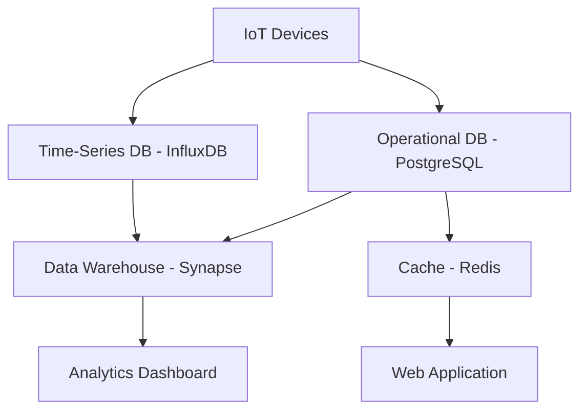

# Database Schema Design

This document defines the database schema and data models for the Educational Platform for Bad Data Science project, including both operational and analytical databases.

## Overview

The database design supports both real-time operational needs and analytical workloads. The architecture includes:
- **Operational Database**: PostgreSQL for transactional data
- **Data Warehouse**: Azure Synapse Analytics for analytical queries
- **Time-Series Database**: InfluxDB for sensor data storage
- **Cache Layer**: Redis for high-performance data access

## Database Architecture

### Multi-Database Strategy



## Operational Database Schema (PostgreSQL)

### Core Tables

#### Users and Authentication
```sql
-- Users table for platform access
CREATE TABLE users (
    user_id UUID PRIMARY KEY DEFAULT gen_random_uuid(),
    email VARCHAR(255) UNIQUE NOT NULL,
    password_hash VARCHAR(255) NOT NULL,
    first_name VARCHAR(100) NOT NULL,
    last_name VARCHAR(100) NOT NULL,
    role VARCHAR(50) NOT NULL DEFAULT 'student',
    institution VARCHAR(255),
    created_at TIMESTAMP WITH TIME ZONE DEFAULT NOW(),
    updated_at TIMESTAMP WITH TIME ZONE DEFAULT NOW(),
    last_login TIMESTAMP WITH TIME ZONE,
    is_active BOOLEAN DEFAULT TRUE,
    email_verified BOOLEAN DEFAULT FALSE
);

-- User sessions for tracking login states
CREATE TABLE user_sessions (
    session_id UUID PRIMARY KEY DEFAULT gen_random_uuid(),
    user_id UUID NOT NULL REFERENCES users(user_id) ON DELETE CASCADE,
    token_hash VARCHAR(255) NOT NULL,
    expires_at TIMESTAMP WITH TIME ZONE NOT NULL,
    created_at TIMESTAMP WITH TIME ZONE DEFAULT NOW(),
    last_accessed TIMESTAMP WITH TIME ZONE DEFAULT NOW(),
    ip_address INET,
    user_agent TEXT
);

-- User roles and permissions
CREATE TABLE roles (
    role_id UUID PRIMARY KEY DEFAULT gen_random_uuid(),
    role_name VARCHAR(50) UNIQUE NOT NULL,
    description TEXT,
    permissions JSONB DEFAULT '{}',
    created_at TIMESTAMP WITH TIME ZONE DEFAULT NOW()
);

CREATE TABLE user_roles (
    user_id UUID NOT NULL REFERENCES users(user_id) ON DELETE CASCADE,
    role_id UUID NOT NULL REFERENCES roles(role_id) ON DELETE CASCADE,
    assigned_at TIMESTAMP WITH TIME ZONE DEFAULT NOW(),
    assigned_by UUID REFERENCES users(user_id),
    PRIMARY KEY (user_id, role_id)
);
```

#### Device Management
```sql
-- IoT devices registry
CREATE TABLE devices (
    device_id UUID PRIMARY KEY DEFAULT gen_random_uuid(),
    device_name VARCHAR(255) NOT NULL,
    device_type VARCHAR(100) NOT NULL,
    manufacturer VARCHAR(255),
    model VARCHAR(255),
    serial_number VARCHAR(255) UNIQUE,
    mac_address MACADDR UNIQUE,
    ip_address INET,
    location JSONB, -- {lat, lng, address, room, building}
    configuration JSONB DEFAULT '{}',
    status VARCHAR(50) DEFAULT 'inactive',
    firmware_version VARCHAR(50),
    last_seen TIMESTAMP WITH TIME ZONE,
    created_at TIMESTAMP WITH TIME ZONE DEFAULT NOW(),
    updated_at TIMESTAMP WITH TIME ZONE DEFAULT NOW(),
    created_by UUID REFERENCES users(user_id)
);

-- Device sensors configuration
CREATE TABLE device_sensors (
    sensor_id UUID PRIMARY KEY DEFAULT gen_random_uuid(),
    device_id UUID NOT NULL REFERENCES devices(device_id) ON DELETE CASCADE,
    sensor_type VARCHAR(100) NOT NULL, -- temperature, humidity, pressure, etc.
    sensor_name VARCHAR(255) NOT NULL,
    unit_of_measurement VARCHAR(50),
    min_value DECIMAL(10,4),
    max_value DECIMAL(10,4),
    accuracy DECIMAL(6,4),
    calibration_date DATE,
    is_active BOOLEAN DEFAULT TRUE,
    configuration JSONB DEFAULT '{}'
);

-- Device connectivity and network information
CREATE TABLE device_connectivity (
    connectivity_id UUID PRIMARY KEY DEFAULT gen_random_uuid(),
    device_id UUID NOT NULL REFERENCES devices(device_id) ON DELETE CASCADE,
    connection_type VARCHAR(50) NOT NULL, -- wifi, ethernet, cellular, lora
    ssid VARCHAR(255),
    signal_strength INTEGER,
    data_usage_mb DECIMAL(10,2) DEFAULT 0,
    last_connection TIMESTAMP WITH TIME ZONE,
    connection_status VARCHAR(50) DEFAULT 'disconnected'
);
```

#### Projects and Experiments
```sql
-- Educational projects/experiments
CREATE TABLE projects (
    project_id UUID PRIMARY KEY DEFAULT gen_random_uuid(),
    project_name VARCHAR(255) NOT NULL,
    description TEXT,
    project_type VARCHAR(100), -- classroom, research, demonstration
    start_date DATE,
    end_date DATE,
    status VARCHAR(50) DEFAULT 'planning',
    created_by UUID NOT NULL REFERENCES users(user_id),
    institution VARCHAR(255),
    grade_level VARCHAR(50),
    subject_area VARCHAR(100),
    learning_objectives TEXT[],
    metadata JSONB DEFAULT '{}',
    created_at TIMESTAMP WITH TIME ZONE DEFAULT NOW(),
    updated_at TIMESTAMP WITH TIME ZONE DEFAULT NOW()
);

-- Project participants (students, teachers)
CREATE TABLE project_participants (
    participant_id UUID PRIMARY KEY DEFAULT gen_random_uuid(),
    project_id UUID NOT NULL REFERENCES projects(project_id) ON DELETE CASCADE,
    user_id UUID NOT NULL REFERENCES users(user_id) ON DELETE CASCADE,
    role VARCHAR(50) NOT NULL, -- teacher, student, observer
    joined_at TIMESTAMP WITH TIME ZONE DEFAULT NOW(),
    permissions JSONB DEFAULT '{}',
    UNIQUE(project_id, user_id)
);

-- Project devices assignment
CREATE TABLE project_devices (
    project_id UUID NOT NULL REFERENCES projects(project_id) ON DELETE CASCADE,
    device_id UUID NOT NULL REFERENCES devices(device_id) ON DELETE CASCADE,
    assigned_at TIMESTAMP WITH TIME ZONE DEFAULT NOW(),
    assigned_by UUID REFERENCES users(user_id),
    configuration_override JSONB,
    PRIMARY KEY (project_id, device_id)
);
```

#### Data Quality and Annotations
```sql
-- Data quality issues tracking
CREATE TABLE data_quality_issues (
    issue_id UUID PRIMARY KEY DEFAULT gen_random_uuid(),
    device_id UUID REFERENCES devices(device_id),
    sensor_id UUID REFERENCES device_sensors(sensor_id),
    project_id UUID REFERENCES projects(project_id),
    issue_type VARCHAR(100) NOT NULL, -- outlier, missing, drift, noise
    severity VARCHAR(50) DEFAULT 'medium', -- low, medium, high, critical
    description TEXT,
    detected_at TIMESTAMP WITH TIME ZONE NOT NULL,
    time_range_start TIMESTAMP WITH TIME ZONE,
    time_range_end TIMESTAMP WITH TIME ZONE,
    auto_detected BOOLEAN DEFAULT FALSE,
    reported_by UUID REFERENCES users(user_id),
    status VARCHAR(50) DEFAULT 'open', -- open, investigating, resolved, false_positive
    resolution_notes TEXT,
    resolved_at TIMESTAMP WITH TIME ZONE,
    resolved_by UUID REFERENCES users(user_id),
    metadata JSONB DEFAULT '{}'
);

-- User annotations and labels for educational purposes
CREATE TABLE data_annotations (
    annotation_id UUID PRIMARY KEY DEFAULT gen_random_uuid(),
    project_id UUID NOT NULL REFERENCES projects(project_id),
    user_id UUID NOT NULL REFERENCES users(user_id),
    device_id UUID REFERENCES devices(device_id),
    sensor_id UUID REFERENCES device_sensors(sensor_id),
    timestamp_start TIMESTAMP WITH TIME ZONE NOT NULL,
    timestamp_end TIMESTAMP WITH TIME ZONE,
    annotation_type VARCHAR(100), -- observation, hypothesis, conclusion, question
    title VARCHAR(255),
    content TEXT,
    tags TEXT[],
    confidence_level INTEGER CHECK (confidence_level BETWEEN 1 AND 5),
    is_public BOOLEAN DEFAULT FALSE,
    created_at TIMESTAMP WITH TIME ZONE DEFAULT NOW(),
    updated_at TIMESTAMP WITH TIME ZONE DEFAULT NOW()
);
```

### Indexes for Performance

```sql
-- Core performance indexes
CREATE INDEX idx_users_email ON users(email);
CREATE INDEX idx_users_role ON users(role);
CREATE INDEX idx_users_institution ON users(institution);

CREATE INDEX idx_devices_status ON devices(status);
CREATE INDEX idx_devices_device_type ON devices(device_type);
CREATE INDEX idx_devices_last_seen ON devices(last_seen);
CREATE INDEX idx_devices_location_gin ON devices USING gin(location);

CREATE INDEX idx_projects_status ON projects(status);
CREATE INDEX idx_projects_created_by ON projects(created_by);
CREATE INDEX idx_projects_dates ON projects(start_date, end_date);

CREATE INDEX idx_data_quality_issues_device ON data_quality_issues(device_id);
CREATE INDEX idx_data_quality_issues_type ON data_quality_issues(issue_type);
CREATE INDEX idx_data_quality_issues_detected ON data_quality_issues(detected_at);

CREATE INDEX idx_annotations_project ON data_annotations(project_id);
CREATE INDEX idx_annotations_user ON data_annotations(user_id);
CREATE INDEX idx_annotations_time ON data_annotations(timestamp_start, timestamp_end);
```

## Time-Series Database Schema (InfluxDB)

### Measurement Definitions

```sql
-- Raw sensor data measurement
-- Measurement: sensor_data
-- Tags: device_id, sensor_type, location, project_id
-- Fields: value, quality_score, battery_level, signal_strength
-- Time: timestamp (automatic)

-- Example data point:
sensor_data,device_id=esp32_001,sensor_type=temperature,location=classroom_a,project_id=proj_123 value=23.5,quality_score=0.95,battery_level=87,signal_strength=-45i 1640995200000000000

-- Aggregated measurements for different time windows
-- Measurement: sensor_data_hourly
sensor_data_hourly,device_id=esp32_001,sensor_type=temperature,location=classroom_a min=20.1,max=25.3,mean=22.7,count=60i 1640995200000000000

-- Measurement: sensor_data_daily
sensor_data_daily,device_id=esp32_001,sensor_type=temperature,location=classroom_a min=18.5,max=26.8,mean=22.1,count=1440i 1640995200000000000
```

### Retention Policies

```sql
-- Retention policies for different data granularities
CREATE RETENTION POLICY "raw_data" ON "sensor_database" DURATION 30d REPLICATION 1 DEFAULT;
CREATE RETENTION POLICY "hourly_data" ON "sensor_database" DURATION 365d REPLICATION 1;
CREATE RETENTION POLICY "daily_data" ON "sensor_database" DURATION 5y REPLICATION 1;

-- Continuous queries for automatic aggregation
CREATE CONTINUOUS QUERY "cq_hourly_mean" ON "sensor_database"
BEGIN
  SELECT mean("value") AS "mean_value", 
         min("value") AS "min_value", 
         max("value") AS "max_value", 
         count("value") AS "count"
  INTO "sensor_data_hourly"
  FROM "sensor_data"
  GROUP BY time(1h), "device_id", "sensor_type", "location", "project_id"
END;

CREATE CONTINUOUS QUERY "cq_daily_stats" ON "sensor_database"
BEGIN
  SELECT mean("mean_value") AS "daily_mean",
         min("min_value") AS "daily_min",
         max("max_value") AS "daily_max",
         sum("count") AS "daily_count"
  INTO "sensor_data_daily"
  FROM "sensor_data_hourly"
  GROUP BY time(1d), "device_id", "sensor_type", "location", "project_id"
END;
```

## Data Warehouse Schema (Azure Synapse Analytics)

### Dimensional Model

```sql
-- Dimension tables for analytics

-- Time dimension
CREATE TABLE dim_time (
    time_key INT IDENTITY(1,1) PRIMARY KEY,
    date_value DATE NOT NULL,
    year_number INT NOT NULL,
    quarter_number INT NOT NULL,
    month_number INT NOT NULL,
    week_number INT NOT NULL,
    day_number INT NOT NULL,
    day_of_week INT NOT NULL,
    day_name VARCHAR(20) NOT NULL,
    month_name VARCHAR(20) NOT NULL,
    is_weekend BOOLEAN NOT NULL,
    is_holiday BOOLEAN DEFAULT FALSE,
    academic_year VARCHAR(10),
    semester VARCHAR(20)
) WITH (DISTRIBUTION = REPLICATE);

-- Device dimension
CREATE TABLE dim_device (
    device_key INT IDENTITY(1,1) PRIMARY KEY,
    device_id UUID NOT NULL,
    device_name VARCHAR(255) NOT NULL,
    device_type VARCHAR(100) NOT NULL,
    manufacturer VARCHAR(255),
    model VARCHAR(255),
    location_building VARCHAR(100),
    location_room VARCHAR(100),
    location_coordinates GEOGRAPHY,
    installation_date DATE,
    status VARCHAR(50),
    current_firmware VARCHAR(50),
    scd_start_date DATE NOT NULL,
    scd_end_date DATE,
    is_current BOOLEAN DEFAULT TRUE
) WITH (DISTRIBUTION = HASH(device_id));

-- Project dimension
CREATE TABLE dim_project (
    project_key INT IDENTITY(1,1) PRIMARY KEY,
    project_id UUID NOT NULL,
    project_name VARCHAR(255) NOT NULL,
    project_type VARCHAR(100),
    institution VARCHAR(255),
    grade_level VARCHAR(50),
    subject_area VARCHAR(100),
    teacher_count INT,
    student_count INT,
    start_date DATE,
    end_date DATE,
    duration_days INT,
    status VARCHAR(50)
) WITH (DISTRIBUTION = REPLICATE);

-- Sensor dimension
CREATE TABLE dim_sensor (
    sensor_key INT IDENTITY(1,1) PRIMARY KEY,
    sensor_id UUID NOT NULL,
    device_key INT REFERENCES dim_device(device_key),
    sensor_type VARCHAR(100) NOT NULL,
    sensor_name VARCHAR(255),
    unit_of_measurement VARCHAR(50),
    measurement_range_min DECIMAL(10,4),
    measurement_range_max DECIMAL(10,4),
    accuracy DECIMAL(6,4),
    calibration_frequency_days INT
) WITH (DISTRIBUTION = HASH(sensor_id));

-- Fact table for sensor measurements
CREATE TABLE fact_sensor_measurements (
    measurement_key BIGINT IDENTITY(1,1) PRIMARY KEY,
    time_key INT NOT NULL REFERENCES dim_time(time_key),
    device_key INT NOT NULL REFERENCES dim_device(device_key),
    sensor_key INT NOT NULL REFERENCES dim_sensor(sensor_key),
    project_key INT REFERENCES dim_project(project_key),
    measurement_timestamp DATETIME2(3) NOT NULL,
    measured_value DECIMAL(12,6),
    quality_score DECIMAL(4,3),
    is_anomaly BOOLEAN DEFAULT FALSE,
    anomaly_score DECIMAL(4,3),
    battery_level INT,
    signal_strength INT,
    processing_flags INT DEFAULT 0,
    created_at DATETIME2(3) DEFAULT GETDATE()
) WITH (
    DISTRIBUTION = HASH(device_key),
    CLUSTERED COLUMNSTORE INDEX
);

-- Fact table for data quality metrics
CREATE TABLE fact_data_quality (
    quality_key BIGINT IDENTITY(1,1) PRIMARY KEY,
    time_key INT NOT NULL REFERENCES dim_time(time_key),
    device_key INT NOT NULL REFERENCES dim_device(device_key),
    sensor_key INT NOT NULL REFERENCES dim_sensor(sensor_key),
    project_key INT REFERENCES dim_project(project_key),
    measurement_hour DATETIME2(0) NOT NULL,
    total_measurements INT NOT NULL,
    valid_measurements INT NOT NULL,
    missing_measurements INT NOT NULL,
    outlier_measurements INT NOT NULL,
    duplicate_measurements INT NOT NULL,
    data_completeness_pct DECIMAL(5,2),
    data_accuracy_score DECIMAL(4,3),
    data_consistency_score DECIMAL(4,3),
    anomaly_count INT DEFAULT 0
) WITH (
    DISTRIBUTION = HASH(device_key),
    CLUSTERED COLUMNSTORE INDEX
);
```

## Cache Layer Schema (Redis)

### Data Structures

```redis
# User session cache
SET user:session:{session_id} "{user_id, role, permissions, expires_at}" EX 3600

# Device status cache  
HSET device:status:{device_id} 
    "status" "online"
    "last_seen" "2025-01-08T10:30:00Z"
    "battery_level" "85"
    "signal_strength" "-42"

# Real-time sensor data cache (latest values)
ZADD sensor:latest:{device_id}:{sensor_type} {timestamp} "{value, quality, timestamp}"

# Project participant cache
SADD project:participants:{project_id} {user_id_1} {user_id_2} {user_id_n}

# Data quality alerts cache
LPUSH alerts:data_quality "{device_id, issue_type, severity, timestamp}"
LTRIM alerts:data_quality 0 99  # Keep only latest 100 alerts

# API rate limiting
INCR rate_limit:{user_id}:{endpoint} EX 3600
```

## Data Migration and ETL Processes

### ETL Pipeline Configuration

```python
# ETL configuration for moving data from operational to analytical databases
ETL_PIPELINES = {
    'sensor_data_etl': {
        'source': 'influxdb',
        'destination': 'synapse',
        'schedule': '0 */6 * * *',  # Every 6 hours
        'batch_size': 100000,
        'transformations': [
            'validate_data_types',
            'calculate_quality_scores',
            'detect_anomalies',
            'apply_business_rules'
        ]
    },
    'device_metadata_sync': {
        'source': 'postgresql',
        'destination': 'synapse',
        'schedule': '0 2 * * *',  # Daily at 2 AM
        'type': 'full_refresh',
        'scd_type': 2  # Slowly changing dimensions type 2
    }
}
```

## Database Administration

### Backup and Recovery

```sql
-- PostgreSQL backup configuration
-- Full backup daily
0 2 * * * pg_dump -U postgres -h localhost -d platform_db | gzip > /backups/platform_$(date +\%Y\%m\%d).sql.gz

-- Point-in-time recovery setup
archive_mode = on
archive_command = 'cp %p /backup/archive/%f'
wal_level = replica
```

### Monitoring and Performance

```sql
-- Key monitoring queries
-- Check database connections
SELECT state, count(*) 
FROM pg_stat_activity 
WHERE datname = 'platform_db' 
GROUP BY state;

-- Monitor slow queries
SELECT query, mean_time, calls, total_time
FROM pg_stat_statements 
WHERE mean_time > 1000 
ORDER BY mean_time DESC 
LIMIT 10;

-- Check table sizes
SELECT schemaname, tablename, 
       pg_size_pretty(pg_total_relation_size(schemaname||'.'||tablename)) as size
FROM pg_tables 
WHERE schemaname = 'public' 
ORDER BY pg_total_relation_size(schemaname||'.'||tablename) DESC;
```

## Security and Compliance

### Data Encryption

```sql
-- Transparent Data Encryption (TDE) for sensitive columns
-- Using PostgreSQL pgcrypto extension

-- Encrypt sensitive user data
CREATE EXTENSION IF NOT EXISTS pgcrypto;

-- Store encrypted passwords
INSERT INTO users (email, password_hash) 
VALUES ('user@example.com', crypt('password', gen_salt('bf')));

-- Verify passwords
SELECT * FROM users 
WHERE email = 'user@example.com' 
AND password_hash = crypt('input_password', password_hash);
```

### Access Control

```sql
-- Role-based database access
CREATE ROLE app_read_only;
GRANT SELECT ON ALL TABLES IN SCHEMA public TO app_read_only;

CREATE ROLE app_read_write;
GRANT SELECT, INSERT, UPDATE, DELETE ON ALL TABLES IN SCHEMA public TO app_read_write;

CREATE ROLE app_admin;
GRANT ALL PRIVILEGES ON ALL TABLES IN SCHEMA public TO app_admin;

-- Row-level security for multi-tenant data
ALTER TABLE projects ENABLE ROW LEVEL SECURITY;

CREATE POLICY project_isolation ON projects
    FOR ALL TO app_user
    USING (institution = current_setting('app.user_institution'));
```

## Educational Notes

### Learning Objectives
- Understand database design principles and normalization
- Learn about dimensional modeling for analytics
- Practice with different database technologies
- Experience multi-database architecture patterns

### Key Concepts Demonstrated
1. **Normalized vs. Denormalized Design**: Operational vs. analytical databases
2. **Time-Series Data Modeling**: Handling sensor data efficiently
3. **Data Quality Tracking**: Building quality into the schema
4. **Security by Design**: Implementing proper access controls

### Best Practices Illustrated
- Use of UUIDs for distributed systems
- Proper indexing strategies
- Data archival and lifecycle management
- Multi-layer caching architecture

### Common Mistakes to Avoid
- Over-normalization in analytical databases
- Insufficient indexing for query patterns
- Lack of data quality tracking
- Poor security implementation

### Next Steps
- Implement database migrations
- Set up automated backups
- Configure monitoring and alerting
- Optimize query performance
