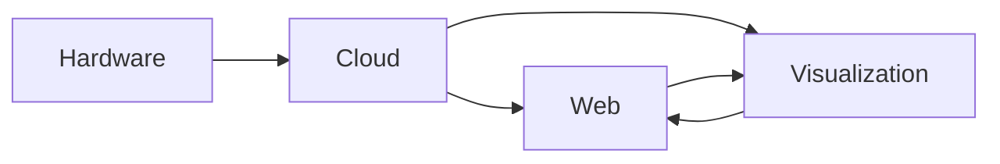

# Project Phases

This section contains documentation for all four phases of the Educational Platform for Bad Data Science project. Each phase represents a distinct component of the system that integrates to form the complete educational platform.

## Phase Overview

The project is structured into four main phases, each building upon the previous to create a comprehensive educational platform:

### [Phase 1: Hardware](./hardware/)
The foundation phase focuses on IoT devices and sensor networks for data collection. This phase covers:
- **Hardware Components**: ESP32 microcontrollers, environmental sensors, power management
- **Data Acquisition**: Real-time sensor data collection and initial processing
- **Communication**: WiFi, MQTT, and cellular connectivity options
- **Integration**: Protocols for connecting hardware to cloud infrastructure

### [Phase 2: Cloud Infrastructure](./cloud/)
The backend phase implements scalable cloud services for data processing and storage:
- **Cloud Architecture**: Microservices design using Azure/AWS services
- **Data Pipelines**: Stream processing, validation, and quality control systems
- **Database Design**: Multi-database strategy for operational and analytical data
- **API Development**: RESTful APIs with real-time communication capabilities
- **Security**: Authentication, authorization, and data protection measures
- **Deployment**: Containerization and orchestration strategies

### [Phase 3: Web Application](./web/)
The frontend phase creates an intuitive web interface for user interaction:
- **Technology Stack**: React, TypeScript, and modern web frameworks
- **User Experience**: Responsive design for multiple device types
- **Data Visualization**: Interactive charts, dashboards, and real-time displays
- **Educational Features**: Guided tutorials, collaborative tools, and progress tracking
- **Performance**: Optimization strategies for large datasets and real-time updates

### [Phase 4: Visualization & Analytics](./visualization/)
The analytics phase provides advanced data analysis and visualization capabilities:
- **Dashboard Design**: Customizable analytics dashboards
- **Analytics Methods**: Statistical analysis, anomaly detection, and machine learning
- **Visualization Tools**: Advanced charting libraries and interactive displays
- **User Guidance**: Educational content integrated with analytical features

## Integration Points

Each phase is designed to integrate seamlessly with others:

### Data Flow
1. **Hardware → Cloud**: Sensor data transmitted via MQTT/HTTP to cloud services
2. **Cloud → Web**: Real-time data streaming and API responses to web application
3. **Cloud → Visualization**: Processed data feeding analytics and visualization components
4. **Web ↔ Visualization**: Interactive integration for user-driven analytics

### Educational Workflow
1. **Setup Phase**: Hardware configuration and project initialization
2. **Data Collection**: Real-time monitoring and quality assessment
3. **Analysis Phase**: Interactive exploration of data patterns and issues
4. **Learning Outcomes**: Collaborative annotation and knowledge building

## Getting Started

To begin working with any phase:

1. **Choose Your Phase**: Select the phase most relevant to your learning objectives
2. **Review Prerequisites**: Each phase documentation includes required knowledge and tools
3. **Follow Setup Guides**: Step-by-step instructions for environment configuration
4. **Complete Exercises**: Hands-on activities designed to reinforce concepts
5. **Integration Testing**: Verify connections between phases as you progress

## Educational Objectives

### Technical Skills Development
- **Hardware**: Embedded programming, sensor interfacing, IoT protocols
- **Cloud**: Distributed systems, data processing, API design, DevOps practices
- **Web**: Modern frontend development, state management, real-time communication
- **Visualization**: Data analysis, statistical methods, interactive design

### Data Science Concepts
- **Data Quality**: Understanding and identifying common data problems
- **Real-time Processing**: Stream processing and immediate data validation
- **Collaborative Analysis**: Team-based data exploration and annotation
- **Educational Methodology**: Learning through hands-on experimentation

## Support and Resources

### Documentation Structure
Each phase includes:
- **Overview**: Introduction and learning objectives
- **Technical Guides**: Detailed implementation instructions
- **Code Examples**: Working implementations and best practices
- **Troubleshooting**: Common issues and solutions
- **Educational Notes**: Key concepts and learning reinforcement

### Community and Collaboration
- **Discussion Forums**: Platform for questions and knowledge sharing
- **Project Templates**: Starting points for common educational scenarios
- **Best Practices**: Curated guidelines for effective implementation
- **Case Studies**: Real-world applications and success stories

## Next Steps

1. **Explore Phase Documentation**: Browse each phase to understand the full scope
2. **Identify Learning Path**: Choose phases based on your educational goals
3. **Set Up Development Environment**: Prepare tools and infrastructure
4. **Start Building**: Begin with Phase 1 (Hardware) or your area of interest
5. **Iterate and Integrate**: Build connections between phases as you progress

This comprehensive approach ensures that learners gain both theoretical understanding and practical experience with modern data science and IoT technologies while working with real-world data quality challenges.
