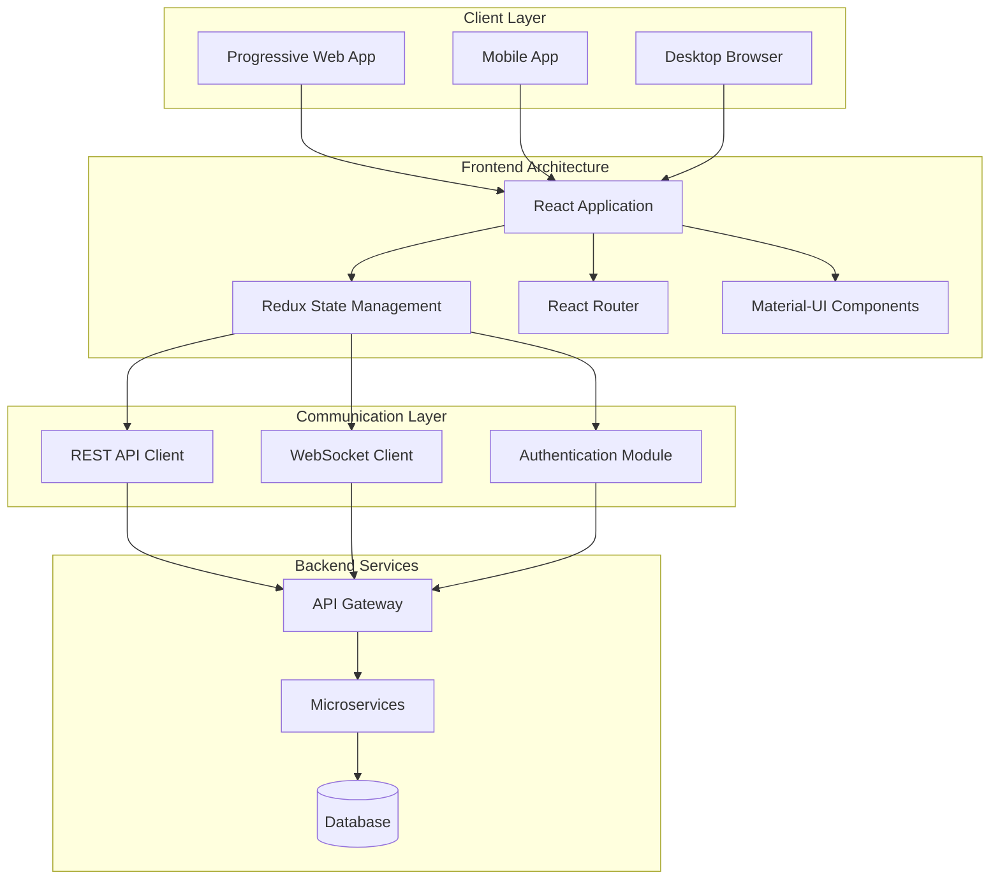

# Web Development Phase

Welcome to the Web Development phase of the Educational Platform for Bad Data Science. This phase focuses on creating an intuitive, responsive, and educational web interface that allows users to interact with IoT sensor data, understand data quality issues, and learn data science concepts through hands-on experience.

## Phase Overview

The web development phase encompasses the creation of a comprehensive web application that serves as the primary interface for students, teachers, and administrators to interact with the platform. The application provides real-time data visualization, educational content, project management tools, and collaborative features.

### Key Objectives

1. **Educational Interface Design**: Create intuitive interfaces that facilitate learning about data science and data quality
2. **Real-time Data Interaction**: Provide seamless access to live sensor data with interactive visualizations
3. **Collaborative Learning**: Enable group projects, data annotation, and peer learning
4. **Responsive Design**: Ensure accessibility across devices (desktop, tablet, mobile)
5. **Progressive Learning**: Support different skill levels from beginner to advanced

## Architecture Overview



## Technology Stack

### Frontend Framework
- **React 18**: Modern JavaScript library for building user interfaces
- **TypeScript**: Type-safe JavaScript development
- **Vite**: Fast build tool and development server
- **React Router**: Client-side routing for single-page application

### State Management
- **Redux Toolkit**: Predictable state container for JavaScript apps
- **RTK Query**: Data fetching and caching solution
- **React Query**: Server state management for real-time data

### UI/UX Libraries
- **Material-UI (MUI)**: React components implementing Google's Material Design
- **Styled Components**: CSS-in-JS styling solution
- **Framer Motion**: Animation library for React
- **React Spring**: Spring-physics animation library

### Data Visualization
- **D3.js**: Data-driven documents for custom visualizations
- **Chart.js**: Simple yet flexible JavaScript charting
- **Plotly.js**: Scientific plotting library
- **Three.js**: 3D graphics library for immersive experiences

### Development Tools
- **ESLint**: Code linting and formatting
- **Prettier**: Code formatting
- **Jest**: JavaScript testing framework
- **React Testing Library**: Testing utilities for React components
- **Cypress**: End-to-end testing framework

## User Experience Design

### User Personas

#### 1. Student (Primary User)
- **Goals**: Learn data science concepts, understand data quality issues, complete assignments
- **Needs**: Simple interface, guided learning, collaborative tools
- **Challenges**: Limited technical background, need for clear explanations

#### 2. Teacher/Instructor (Primary User)
- **Goals**: Create educational projects, monitor student progress, demonstrate concepts
- **Needs**: Project management tools, student oversight, curriculum integration
- **Challenges**: Time constraints, varying technical expertise

#### 3. Administrator (Secondary User)
- **Goals**: Manage platform users, oversee system health, configure settings
- **Needs**: Administrative dashboards, user management, system monitoring
- **Challenges**: Multiple responsibilities, need for comprehensive overview

### Design Principles

1. **Progressive Disclosure**: Present information in digestible layers
2. **Contextual Help**: Provide assistance when and where needed
3. **Visual Feedback**: Clear indication of system status and user actions
4. **Accessibility**: Ensure usability for users with disabilities
5. **Mobile-First**: Design for mobile devices, enhance for desktop

## Core Features

### 1. Dashboard and Overview
- Real-time system status
- Recent activity feed
- Quick access to projects and data
- Personalized learning recommendations
- Data quality alerts and notifications

### 2. Project Management
- Create and configure educational projects
- Assign devices to projects
- Manage project participants (students and teachers)
- Set learning objectives and timelines
- Track project progress and milestones

### 3. Data Exploration
- Interactive data tables with filtering and sorting
- Real-time data streaming visualization
- Historical data analysis tools
- Data export and download functionality
- Custom query builder for advanced users

### 4. Data Quality Learning
- Interactive tutorials on data quality concepts
- Real-time identification of data quality issues
- Collaborative annotation of problematic data
- Gamified learning challenges
- Progress tracking and achievements

### 5. Visualization Tools
- Drag-and-drop chart builder
- Pre-configured visualization templates
- Interactive dashboards
- 3D sensor placement visualization
- Custom visualization sharing

### 6. Collaboration Features
- Real-time collaborative editing
- Discussion threads on data points
- Peer review and feedback system
- Group project workspaces
- Knowledge sharing repository

## Application Structure

### Component Hierarchy

```
src/
├── components/
│   ├── common/
│   │   ├── Header/
│   │   ├── Navigation/
│   │   ├── Footer/
│   │   └── Layout/
│   ├── dashboard/
│   │   ├── DashboardOverview/
│   │   ├── RecentActivity/
│   │   ├── QuickActions/
│   │   └── AlertsPanel/
│   ├── projects/
│   │   ├── ProjectList/
│   │   ├── ProjectCard/
│   │   ├── ProjectForm/
│   │   └── ProjectDetails/
│   ├── data/
│   │   ├── DataTable/
│   │   ├── DataFilters/
│   │   ├── DataExport/
│   │   └── RealTimeStream/
│   ├── visualizations/
│   │   ├── ChartBuilder/
│   │   ├── InteractiveCharts/
│   │   ├── Dashboard/
│   │   └── 3DVisualization/
│   ├── learning/
│   │   ├── TutorialSteps/
│   │   ├── ConceptExplanation/
│   │   ├── InteractiveExercise/
│   │   └── ProgressTracker/
│   └── collaboration/
│       ├── DiscussionThread/
│       ├── AnnotationTool/
│       ├── PeerReview/
│       └── SharedWorkspace/
├── pages/
│   ├── Dashboard/
│   ├── Projects/
│   ├── DataExploration/
│   ├── Learning/
│   ├── Profile/
│   └── Admin/
├── hooks/
│   ├── useAuth.ts
│   ├── useWebSocket.ts
│   ├── useDataStream.ts
│   └── useProjectData.ts
├── services/
│   ├── api.ts
│   ├── websocket.ts
│   ├── auth.ts
│   └── storage.ts
├── store/
│   ├── authSlice.ts
│   ├── projectsSlice.ts
│   ├── dataSlice.ts
│   └── uiSlice.ts
├── utils/
│   ├── formatters.ts
│   ├── validators.ts
│   ├── constants.ts
│   └── helpers.ts
└── types/
    ├── api.ts
    ├── user.ts
    ├── project.ts
    └── data.ts
```

## Development Workflow

### Local Development Setup

```bash
# Prerequisites
node --version  # v18 or higher
npm --version   # v8 or higher

# Clone repository
git clone https://github.com/platform-edu/web-app.git
cd web-app

# Install dependencies
npm install

# Set up environment variables
cp .env.example .env.local
# Edit .env.local with your configuration

# Start development server
npm run dev

# Run tests
npm run test

# Run e2e tests
npm run test:e2e

# Build for production
npm run build

# Preview production build
npm run preview
```

### Code Quality Standards

```json
{
  "scripts": {
    "lint": "eslint src --ext .ts,.tsx --fix",
    "format": "prettier --write src/**/*.{ts,tsx,json,css,md}",
    "type-check": "tsc --noEmit",
    "test": "jest",
    "test:watch": "jest --watch",
    "test:coverage": "jest --coverage",
    "test:e2e": "cypress open"
  }
}
```

## State Management Architecture

### Redux Store Structure

```typescript
interface RootState {
  auth: AuthState;
  ui: UIState;
  projects: ProjectsState;
  data: DataState;
  learning: LearningState;
  collaboration: CollaborationState;
}

interface AuthState {
  user: User | null;
  isAuthenticated: boolean;
  loading: boolean;
  error: string | null;
}

interface ProjectsState {
  projects: Project[];
  currentProject: Project | null;
  loading: boolean;
  error: string | null;
}

interface DataState {
  sensorData: SensorReading[];
  filters: DataFilters;
  realTimeConnection: WebSocketState;
  qualityIssues: DataQualityIssue[];
}
```

## API Integration

### HTTP Client Configuration

```typescript
// services/api.ts
import axios from 'axios';
import { store } from '../store';
import { logout } from '../store/authSlice';

const api = axios.create({
  baseURL: process.env.REACT_APP_API_URL,
  timeout: 10000,
});

// Request interceptor for authentication
api.interceptors.request.use(
  (config) => {
    const token = store.getState().auth.token;
    if (token) {
      config.headers.Authorization = `Bearer ${token}`;
    }
    return config;
  },
  (error) => Promise.reject(error)
);

// Response interceptor for error handling
api.interceptors.response.use(
  (response) => response,
  (error) => {
    if (error.response?.status === 401) {
      store.dispatch(logout());
    }
    return Promise.reject(error);
  }
);

export default api;
```

### Real-time Data Connection

```typescript
// hooks/useWebSocket.ts
import { useEffect, useRef, useState } from 'react';
import { useDispatch } from 'react-redux';
import { addSensorReading } from '../store/dataSlice';

interface UseWebSocketOptions {
  url: string;
  reconnectInterval?: number;
  maxReconnectAttempts?: number;
}

export const useWebSocket = ({
  url,
  reconnectInterval = 5000,
  maxReconnectAttempts = 5
}: UseWebSocketOptions) => {
  const [isConnected, setIsConnected] = useState(false);
  const [error, setError] = useState<string | null>(null);
  const wsRef = useRef<WebSocket | null>(null);
  const reconnectAttemptsRef = useRef(0);
  const dispatch = useDispatch();

  const connect = useCallback(() => {
    try {
      wsRef.current = new WebSocket(url);
      
      wsRef.current.onopen = () => {
        setIsConnected(true);
        setError(null);
        reconnectAttemptsRef.current = 0;
      };
      
      wsRef.current.onmessage = (event) => {
        const data = JSON.parse(event.data);
        if (data.type === 'sensor_data') {
          dispatch(addSensorReading(data.payload));
        }
      };
      
      wsRef.current.onclose = () => {
        setIsConnected(false);
        
        // Attempt reconnection
        if (reconnectAttemptsRef.current < maxReconnectAttempts) {
          setTimeout(() => {
            reconnectAttemptsRef.current++;
            connect();
          }, reconnectInterval);
        }
      };
      
      wsRef.current.onerror = (error) => {
        setError('WebSocket connection failed');
        console.error('WebSocket error:', error);
      };
    } catch (err) {
      setError('Failed to create WebSocket connection');
    }
  }, [url, reconnectInterval, maxReconnectAttempts, dispatch]);

  useEffect(() => {
    connect();
    
    return () => {
      if (wsRef.current) {
        wsRef.current.close();
      }
    };
  }, [connect]);

  return { isConnected, error };
};
```

## Security Implementation

### Authentication and Authorization

```typescript
// hooks/useAuth.ts
import { useSelector, useDispatch } from 'react-redux';
import { RootState } from '../store';
import { login, logout, refreshToken } from '../store/authSlice';

export const useAuth = () => {
  const dispatch = useDispatch();
  const { user, isAuthenticated, loading } = useSelector(
    (state: RootState) => state.auth
  );

  const handleLogin = async (email: string, password: string) => {
    try {
      await dispatch(login({ email, password })).unwrap();
    } catch (error) {
      throw new Error('Login failed');
    }
  };

  const handleLogout = () => {
    dispatch(logout());
  };

  const hasPermission = (permission: string): boolean => {
    return user?.permissions?.includes(permission) || false;
  };

  const hasRole = (role: string): boolean => {
    return user?.role === role;
  };

  return {
    user,
    isAuthenticated,
    loading,
    login: handleLogin,
    logout: handleLogout,
    hasPermission,
    hasRole,
  };
};
```

### Route Protection

```typescript
// components/common/ProtectedRoute.tsx
import React from 'react';
import { Navigate, useLocation } from 'react-router-dom';
import { useAuth } from '../../hooks/useAuth';

interface ProtectedRouteProps {
  children: React.ReactNode;
  requiredPermission?: string;
  requiredRole?: string;
  fallback?: React.ReactNode;
}

export const ProtectedRoute: React.FC<ProtectedRouteProps> = ({
  children,
  requiredPermission,
  requiredRole,
  fallback = <Navigate to="/login" replace />
}) => {
  const { isAuthenticated, hasPermission, hasRole } = useAuth();
  const location = useLocation();

  if (!isAuthenticated) {
    return <Navigate to="/login" state={{ from: location }} replace />;
  }

  if (requiredPermission && !hasPermission(requiredPermission)) {
    return <Navigate to="/unauthorized" replace />;
  }

  if (requiredRole && !hasRole(requiredRole)) {
    return <Navigate to="/unauthorized" replace />;
  }

  return <>{children}</>;
};
```

## Performance Optimization

### Code Splitting and Lazy Loading

```typescript
// App.tsx
import React, { Suspense } from 'react';
import { BrowserRouter, Routes, Route } from 'react-router-dom';
import { LoadingSpinner } from './components/common/LoadingSpinner';

// Lazy load components
const Dashboard = React.lazy(() => import('./pages/Dashboard'));
const Projects = React.lazy(() => import('./pages/Projects'));
const DataExploration = React.lazy(() => import('./pages/DataExploration'));
const Learning = React.lazy(() => import('./pages/Learning'));

export const App: React.FC = () => {
  return (
    <BrowserRouter>
      <Suspense fallback={<LoadingSpinner />}>
        <Routes>
          <Route path="/" element={<Dashboard />} />
          <Route path="/projects" element={<Projects />} />
          <Route path="/data" element={<DataExploration />} />
          <Route path="/learning" element={<Learning />} />
        </Routes>
      </Suspense>
    </BrowserRouter>
  );
};
```

### Virtual Scrolling for Large Datasets

```typescript
// components/data/VirtualizedDataTable.tsx
import React, { useMemo } from 'react';
import { FixedSizeList as List } from 'react-window';

interface VirtualizedDataTableProps {
  data: any[];
  height: number;
  itemHeight: number;
  columns: Column[];
}

export const VirtualizedDataTable: React.FC<VirtualizedDataTableProps> = ({
  data,
  height,
  itemHeight,
  columns
}) => {
  const Row = useMemo(() => 
    ({ index, style }: { index: number; style: React.CSSProperties }) => (
      <div style={style}>
        {columns.map((column) => (
          <div key={column.key} className="table-cell">
            {data[index][column.key]}
          </div>
        ))}
      </div>
    ), [data, columns]
  );

  return (
    <List
      height={height}
      itemCount={data.length}
      itemSize={itemHeight}
      width="100%"
    >
      {Row}
    </List>
  );
};
```

## Testing Strategy

### Unit Testing with Jest and React Testing Library

```typescript
// components/projects/ProjectCard.test.tsx
import React from 'react';
import { render, screen, fireEvent } from '@testing-library/react';
import { Provider } from 'react-redux';
import { BrowserRouter } from 'react-router-dom';
import { store } from '../../store';
import { ProjectCard } from './ProjectCard';

const mockProject = {
  id: '1',
  name: 'Test Project',
  description: 'A test project',
  status: 'active',
  participantCount: 5,
  deviceCount: 3,
};

const renderWithProviders = (component: React.ReactElement) => {
  return render(
    <Provider store={store}>
      <BrowserRouter>
        {component}
      </BrowserRouter>
    </Provider>
  );
};

describe('ProjectCard', () => {
  it('renders project information correctly', () => {
    renderWithProviders(<ProjectCard project={mockProject} />);
    
    expect(screen.getByText('Test Project')).toBeInTheDocument();
    expect(screen.getByText('A test project')).toBeInTheDocument();
    expect(screen.getByText('5 participants')).toBeInTheDocument();
    expect(screen.getByText('3 devices')).toBeInTheDocument();
  });

  it('navigates to project details on click', () => {
    renderWithProviders(<ProjectCard project={mockProject} />);
    
    const card = screen.getByRole('button');
    fireEvent.click(card);
    
    expect(window.location.pathname).toBe('/projects/1');
  });
});
```

## Educational Integration

### Learning Path Integration

The web interface incorporates educational elements throughout the user experience:

1. **Contextual Tutorials**: Step-by-step guides that appear when users encounter new features
2. **Interactive Exercises**: Hands-on activities that teach data quality concepts
3. **Progress Tracking**: Visual indicators of learning progress and achievements
4. **Collaborative Learning**: Tools for group discussions and peer learning

### Data Quality Education

Special emphasis on teaching data quality concepts through:
- Real-time identification of data anomalies
- Interactive explanations of quality metrics
- Gamified challenges to improve data understanding
- Case studies based on real sensor data

## Accessibility and Internationalization

### Accessibility (a11y) Implementation

```typescript
// utils/accessibility.ts
import { useEffect } from 'react';

export const useA11yAnnouncement = (message: string, priority: 'polite' | 'assertive' = 'polite') => {
  useEffect(() => {
    const announcement = document.createElement('div');
    announcement.setAttribute('aria-live', priority);
    announcement.setAttribute('aria-atomic', 'true');
    announcement.setAttribute('class', 'sr-only');
    announcement.textContent = message;
    
    document.body.appendChild(announcement);
    
    setTimeout(() => {
      document.body.removeChild(announcement);
    }, 1000);
  }, [message, priority]);
};

export const useFocusManagement = () => {
  const setFocus = (elementId: string) => {
    const element = document.getElementById(elementId);
    if (element) {
      element.focus();
    }
  };

  const trapFocus = (containerId: string) => {
    const container = document.getElementById(containerId);
    if (!container) return;

    const focusableElements = container.querySelectorAll(
      'button, [href], input, select, textarea, [tabindex]:not([tabindex="-1"])'
    );
    
    const firstElement = focusableElements[0] as HTMLElement;
    const lastElement = focusableElements[focusableElements.length - 1] as HTMLElement;

    const handleTabKey = (e: KeyboardEvent) => {
      if (e.key === 'Tab') {
        if (e.shiftKey) {
          if (document.activeElement === firstElement) {
            lastElement.focus();
            e.preventDefault();
          }
        } else {
          if (document.activeElement === lastElement) {
            firstElement.focus();
            e.preventDefault();
          }
        }
      }
    };

    container.addEventListener('keydown', handleTabKey);
    return () => container.removeEventListener('keydown', handleTabKey);
  };

  return { setFocus, trapFocus };
};
```

## Educational Notes

### Learning Objectives
- Understand modern web application architecture
- Learn React ecosystem and best practices
- Practice state management patterns
- Experience real-time web technologies
- Implement accessibility and user experience principles

### Key Concepts Demonstrated
1. **Component-Based Architecture**: Modular, reusable UI components
2. **State Management**: Centralized application state with Redux
3. **Real-Time Communication**: WebSocket integration for live data
4. **Performance Optimization**: Code splitting and virtual scrolling
5. **Testing Strategies**: Unit, integration, and end-to-end testing

### Best Practices Illustrated
- TypeScript for type safety
- Responsive design principles
- Accessibility standards (WCAG 2.1)
- Security-first development
- Progressive enhancement

### Common Web Development Challenges
- Managing complex application state
- Optimizing performance for large datasets
- Ensuring cross-browser compatibility
- Implementing secure authentication
- Creating intuitive user experiences

### Next Steps
- Implement advanced data visualization features
- Add offline capabilities with service workers
- Enhance mobile experience with native app features
- Integrate advanced analytics and user behavior tracking
- Expand collaboration tools and real-time features

This web development phase provides a solid foundation for creating an engaging, educational, and technically robust web application that serves the platform's educational objectives while demonstrating modern web development practices.
